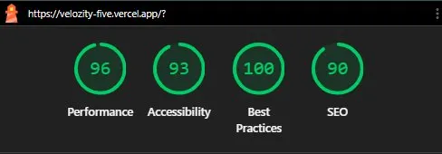

# Velozity Project Tracker

A fully functional project management UI built as part of the Velozity Global Solutions Frontend Developer Technical Assessment.

**Live Demo:** https://velozity-five.vercel.app/  
**Repository:** https://github.com/NoB0T21/Velozity

---

## Setup Instructions

```bash
# Clone the repository
git clone https://github.com/NoB0T21/Velozity.git
cd Velozity

# Install dependencies
npm install

# Start development server
npm run dev

# Build for production
npm run build

# Preview production build locally
npm run preview
```

---

## Features

- **Three Views** — Kanban board, List view, and Timeline/Gantt view of the same shared dataset
- **Custom Drag and Drop** — built from scratch using Pointer Events API, works on mouse and touch
- **Virtual Scrolling** — custom implementation handling 500+ tasks with no performance degradation
- **URL-Synced Filters** — filter state persisted in query parameters, shareable and bookmarkable
- **Seed Data Generator** — generates 500+ randomised tasks including overdue and edge cases

---

## State Management Decision

**Zustand** was chosen over React Context + useReducer for one primary reason: Zustand uses a subscription model where components only re-render when the specific slice of state they subscribe to changes. With 500 tasks in state and filters potentially changing on every keystroke, a Context-based approach would re-render the entire component tree on every filter update. Zustand's selector pattern (`useTaskStore((s) => s.filters)`) ensures only the components that care about filters re-render, keeping the UI responsive at scale.

Derived state (filtered tasks) is intentionally kept **outside** the store as selector functions. Storing derived state in Zustand would require manual synchronisation between source and derived values — instead, filtering and sorting are computed on read via `useMemo`, which React handles automatically when dependencies change.

---

## Virtual Scrolling Implementation

The list view handles 500+ tasks by only rendering the rows currently visible in the viewport plus a buffer of 5 rows above and below.

**How it works:**

1. A full-height spacer `div` is rendered with `height = totalTasks × ROW_HEIGHT`. This makes the scrollbar accurate without rendering every row.
2. On scroll, `scrollTop` is tracked via the `onScroll` event.
3. The visible window is calculated:
   ```
   startIndex = Math.floor(scrollTop / ROW_HEIGHT) - BUFFER
   endIndex   = startIndex + Math.ceil(viewportHeight / ROW_HEIGHT) + BUFFER * 2
   ```
4. Only `tasks.slice(startIndex, endIndex)` are rendered into the DOM.
5. The rendered rows are offset into their correct position using `transform: translateY(startIndex × ROW_HEIGHT)`.

---

## Drag and Drop Approach

Drag and drop is implemented from scratch using the **Pointer Events API** (`onPointerDown`, `onPointerMove`, `onPointerUp`) rather than the HTML Drag and Drop API (`draggable`, `ondragstart`). This decision was made because the HTML Drag API does not fire events on touch devices — Pointer Events work identically on mouse, touch, and stylus with no special handling required.

---

## Lighthouse Report

Tested on the production deployment at https://velozity-five.vercel.app/

| Metric | Score |
|---|---|
| Performance | 96 |
| Accessibility | 93 |
| Best Practices | 100 |
| SEO | 90 |


